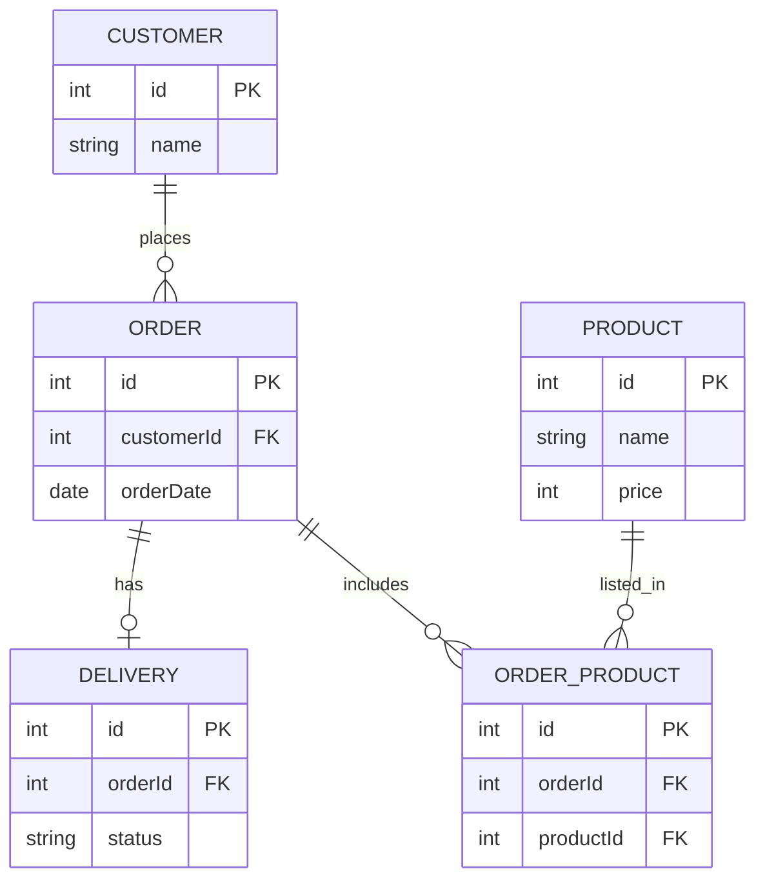

# ER Diagram

```mermaid
erDiagram
    CUSTOMER {
        int id PK
        string name
    }

    ORDER {
        int id PK
        int customerId FK
        date orderDate
    }

    PRODUCT {
        int id PK
        string name
        int price
    }

    DELIVERY {
        int id PK
        int orderId FK
        string status
    }

    ORDER_PRODUCT {
        int id PK
        int orderId FK
        int productId FK
    }

    CUSTOMER ||--o{ ORDER : places
    ORDER ||--o| DELIVERY : has
    ORDER ||--o{ ORDER_PRODUCT : includes
    PRODUCT ||--o{ ORDER_PRODUCT : listed_in
```
# online-shopping
# online-shopping
